# CZ-Dev-RAG

> Local, graph-based knowledge base for a two-person software agency. LightRAG + RAG-Anything on an RTX 3090, Windows-native Ollama, Tailscale for remote access. **Public code, private data.**

  

**Repository state:** phases 01–02 landing. Compose stack + demo corpus + quickstart are live; retrieval polish (reranker, evals, MCP, Langfuse tracing) follows in [`ROADMAP.md`](./ROADMAP.md).

## What this is

An internal, locally-hosted knowledge base for CZ Dev ([czaban.dev](https://czaban.dev)). Client contracts, meeting notes, and SOWs are ingested into a LightRAG graph on an RTX 3090 running Windows 11 with native Ollama. Queries run through the LightRAG web UI or via a dedicated MCP server that exposes the KB as a tool to Claude Code / Cursor. Tamas and Zsombor access the same KB from anywhere over Tailscale.

The repo is public and doubles as a portfolio artifact for AI/ML Engineer job applications. Client data is never committed; a synthetic [`examples/demo-corpus/`](./examples/demo-corpus/) makes the repo runnable by anyone cloning it.

## Architecture

```mermaid
flowchart LR
    Docs[data/input/&#123;client_slug&#125;/] --> MinerU
    Demo[examples/demo-corpus/] --> MinerU
    MinerU[MinerU parser<br/>CPU] --> LightRAG
    subgraph Host[Windows 11 + RTX 3090]
        Ollama[Ollama native<br/>BGE-M3 + Qwen2.5-32B]
    end
    subgraph Docker[Docker Desktop]
        LightRAG[LightRAG server<br/>+ RAG-Anything]
        Reranker[BGE-reranker-v2-m3]
        Langfuse[Langfuse<br/>tracing]
        MCP[MCP server<br/>query_kb + list_documents]
    end
    LightRAG -->|extract + embed| Ollama
    LightRAG --> Reranker
    LightRAG --> Langfuse
    MCP --> LightRAG
    LightRAG --> Storage[(nano-vectordb<br/>+ file graph)]
    Tailscale[Tailscale<br/>tamas + zsombor devices] --> LightRAG
    Tailscale --> MCP
```



Deeper details: [`docs/ARCHITECTURE.md`](./docs/ARCHITECTURE.md). Rationale for each tech choice: [`docs/DECISIONS.md`](./docs/DECISIONS.md) (10 ADRs).

## Quickstart

> Target: working demo in **15 minutes** on a fresh Windows 11 machine (excluding model pull time — models are ~20 GB combined and pull once).

### Prerequisites

1. [Ollama for Windows](https://ollama.com/download/windows) — installed and running
2. [Docker Desktop](https://www.docker.com/products/docker-desktop/) — installed and running
3. NVIDIA driver ≥ 550 (Ollama uses your GPU directly; Docker services run on CPU)

### Install + run

```bash
git clone https://github.com/TamasCzaban/CZ-Dev-RAG
cd CZ-Dev-RAG

# One-time model pulls (~20 GB — takes 10–20 min on first run)
ollama pull bge-m3
ollama pull qwen2.5:32b-instruct-q4_K_M

# Start the stack
cp .env.example .env
docker compose up -d
docker compose ps           # wait until lightrag + langfuse-web are healthy

# Open the LightRAG web UI
#   http://localhost:9621   — upload + query
#   http://localhost:3000   — Langfuse (set up an org on first visit; wiring lands in phase 10)
```

### Ingest the demo corpus

```bash
# From the LightRAG web UI, upload everything under:
#   examples/demo-corpus/
# (5 synthetic documents — MSA, SOW, meeting notes, pricing, EN+HU one-pager.
#  Details: examples/demo-corpus/README.md)
```

First-time graph build for the demo corpus takes ~3–5 min on a 3090 (Qwen2.5-32B runs entity + relation extraction across all chunks).

### Try these queries

Once the demo corpus is ingested, try these in the LightRAG web UI:

1. **Contract lookup:** *What are the payment terms in the AcmeCo MSA?*
2. **Cross-document:** *What is the total value of SOW-001, and how does it compare to CZ Dev's build sprint pricing range?*
3. **Narrative:** *What did BEMER decide was out of scope for v2?*
4. **Multilingual:** *Mit csinál a CZ Dev?* (Hungarian — "What does CZ Dev do?")
5. **Dates:** *When is milestone M3 of SOW-001 due, and what does it deliver?*

All of these queries have known-good answers in the corpus; they're the same questions the Ragas eval harness (phase 05) will score across all four retrieval modes.

## Evaluation results

<!-- EVAL:START -->
_Eval harness lands in phase 05 — table will be auto-populated from `evals/results/<timestamp>.csv` by `evals/run_evals.py --output-readme`._

| Mode    | Faithfulness | Answer Relevancy | Context Precision |
|---------|--------------|------------------|-------------------|
| naive   | —            | —                | —                 |
| local   | —            | —                | —                 |
| global  | —            | —                | —                 |
| hybrid  | —            | —                | —                 |
<!-- EVAL:END -->

## MCP server

The MCP wrapper lands in phase 07. When it does, registering the KB with Claude Code will look like this:

```json
{
  "mcpServers": {
    "cz-dev-kb": {
      "command": "docker",
      "args": ["exec", "-i", "cz-dev-rag-mcp", "python", "/app/server.py"]
    }
  }
}
```

Exposed tools: `query_kb(question, mode)` and `list_documents()`. Full details in [`docs/ARCHITECTURE.md`](./docs/ARCHITECTURE.md) once phase 07 ships.

## Documentation

- [`ROADMAP.md`](./ROADMAP.md) — implementation phases (10 vertical slices)
- [`STATE.md`](./STATE.md) — current phase + status
- [`docs/ARCHITECTURE.md`](./docs/ARCHITECTURE.md) — data flow + component boundaries
- [`docs/DECISIONS.md`](./docs/DECISIONS.md) — 10 ADRs explaining why-this-not-that
- [`examples/demo-corpus/README.md`](./examples/demo-corpus/README.md) — what each demo document is for

## Built with

[LightRAG](https://github.com/HKUDS/LightRAG) · [RAG-Anything](https://github.com/HKUDS/RAG-Anything) · [Ollama](https://ollama.com) · [Langfuse](https://langfuse.com) · [Ragas](https://docs.ragas.io) · [MinerU](https://github.com/opendatalab/MinerU) · [Tailscale](https://tailscale.com) · [uv](https://github.com/astral-sh/uv)

## License

MIT — see [LICENSE](./LICENSE).

---

Built by [Tamas Czaban](https://czaban.dev) · CZ Dev software agency.
